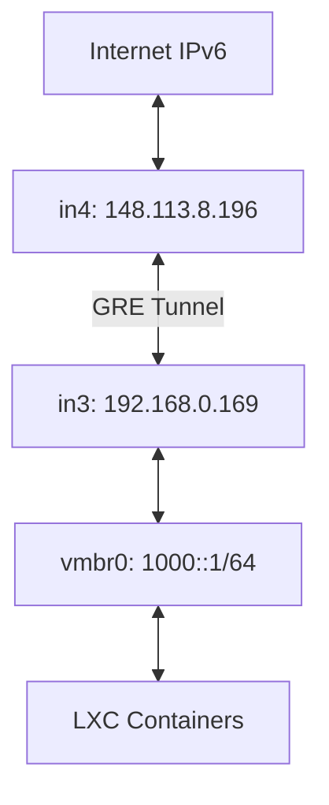

## Overview

This guide walks you through setting up IPv6 connectivity for your home network using a GRE tunnel when your ISP doesn't provide native IPv6.

<CardGroup cols={2}>
  <Card title="in4 (Dual-stack Server)" icon="server">
    - IPv4: `148.113.8.196`
    - IPv6: `2402:1f00:8300:4c4::/64`
    - Tunnel: `2402:1f00:8300:4c4::1/128`
  </Card>
  <Card title="in3 (Home PVE Server)" icon="house">
    - IPv4: `192.168.0.169`
    - Tunnel: `2402:1f00:8300:4c4::2/128`
    - LAN: `2402:1f00:8300:4c4:1000::1/64`
  </Card>
</CardGroup>

### Network Topology



<Warning>
  **MTU Important**: GRE tunnels require MTU of 1400 to avoid packet fragmentation issues.
</Warning>

---

## Initial Setup

<Steps>
  <Step title="Load Kernel Modules">
    Run on **both in4 and in3**:
    
    ```bash
    modprobe ip_gre
    echo "ip_gre" | tee /etc/modules-load.d/gre.conf
    ```
  </Step>

  <Step title="Create GRE Tunnel">
    ### On in4 (148.113.8.196)
    
    ```bash
    ip tunnel add gre1 mode gre remote 192.168.0.169 local 148.113.8.196 ttl 255
    ip link set gre1 mtu 1400 up
    ip addr add 10.0.0.1/30 dev gre1
    ip -6 addr add 2402:1f00:8300:4c4::1/128 dev gre1
    ```
    
    ### On in3 (192.168.0.169)
    
    ```bash
    ip tunnel add gre1 mode gre remote 148.113.8.196 local 192.168.0.169 ttl 255
    ip link set gre1 mtu 1400 up
    ip addr add 10.0.0.2/30 dev gre1
    ip -6 addr add 2402:1f00:8300:4c4::2/128 dev gre1
    ```
    
    <Tip>Test the tunnel with: `ping 10.0.0.1` from in3</Tip>
  </Step>

  <Step title="Enable IPv6 Forwarding">
    ### On in4
    
    ```bash
    sysctl -w net.ipv6.conf.all.forwarding=1
    sysctl -w net.ipv6.conf.gre1.forwarding=1
    sysctl -w net.ipv6.conf.vmbr0.forwarding=1
    sysctl -w net.ipv6.conf.gre1.accept_ra=0
    sysctl -w net.ipv6.conf.all.accept_ra=0
    ```
    
    Make persistent:
    
    ```bash
    cat >> /etc/sysctl.conf << EOF
    net.ipv6.conf.all.forwarding=1
    net.ipv6.conf.gre1.accept_ra=0
    net.ipv6.conf.all.accept_ra=0
    EOF
    ```
    
    ### On in3
    
    ```bash
    sysctl -w net.ipv6.conf.all.forwarding=1
    sysctl -w net.ipv6.conf.gre1.forwarding=1
    sysctl -w net.ipv6.conf.vmbr0.forwarding=1
    echo "net.ipv6.conf.all.forwarding=1" >> /etc/sysctl.conf
    ```
  </Step>

  <Step title="Configure Routing">
    ### On in4
    
    ```bash
    ip -6 route add 2402:1f00:8300:4c4:1000::/64 dev gre1
    ```
    
    ### On in3
    
    ```bash
    # Assign subnet to vmbr0
    ip -6 addr add 2402:1f00:8300:4c4:1000::1/64 dev vmbr0
    
    # Route to tunnel endpoint
    ip -6 route add 2402:1f00:8300:4c4::1/128 dev gre1
    
    # Default route
    ip -6 route add default via 2402:1f00:8300:4c4::1 dev gre1
    ```
    
    <Check>Test with: `ping6 google.com` from in3</Check>
  </Step>

  <Step title="Configure Firewall">
    ### On in4
    
    ```bash
    # Allow ICMPv6
    ip6tables -A INPUT -p ipv6-icmp -j ACCEPT
    ip6tables -A OUTPUT -p ipv6-icmp -j ACCEPT
    ip6tables -A FORWARD -p ipv6-icmp -j ACCEPT
    
    # Allow forwarding
    ip6tables -A FORWARD -i gre1 -j ACCEPT
    ip6tables -A FORWARD -o gre1 -j ACCEPT
    ip6tables -P FORWARD ACCEPT
    
    # CRITICAL: Prevent masquerading of routed subnet
    ip6tables -t nat -I POSTROUTING 2 -s 2402:1f00:8300:4c4::/64 -o vmbr0 -j ACCEPT
    ```
    
    ### On in3
    
    ```bash
    ip6tables -A FORWARD -i gre1 -j ACCEPT
    ip6tables -A FORWARD -o gre1 -j ACCEPT
    ip6tables -A FORWARD -i vmbr0 -j ACCEPT
    ip6tables -A FORWARD -o vmbr0 -j ACCEPT
    ip6tables -P FORWARD ACCEPT
    ```
  </Step>

  <Step title="Enable Proxy NDP">
    <Warning>
      **Critical**: Proxy NDP is required for inbound connectivity from the internet.
    </Warning>
    
    ### On in4
    
    ```bash
    sysctl -w net.ipv6.conf.vmbr0.proxy_ndp=1
    echo "net.ipv6.conf.vmbr0.proxy_ndp=1" >> /etc/sysctl.conf
    ```
  </Step>
</Steps>

---

## Adding New IPv6 Addresses

<Steps>
  <Step title="Add Proxy NDP Entry">
    On in4, add proxy NDP for each new IP:
    
    ```bash
    ip -6 neigh add proxy 2402:1f00:8300:4c4:1001::1 dev vmbr0
    ip -6 neigh add proxy 2402:1f00:8300:4c4:1002::1 dev vmbr0
    ip -6 neigh add proxy 2402:1f00:8300:4c4:1003::1 dev vmbr0
    ```
    
    Verify:
    
    ```bash
    ip -6 neigh show proxy
    ```
  </Step>

  <Step title="Configure LXC/VM">
    On the container or VM:
    
    ```bash
    # Assign IP
    ip -6 addr add 2402:1f00:8300:4c4:1001::1/128 dev eth0
    
    # Set MTU
    ip link set eth0 mtu 1400
    
    # Add gateway
    ip -6 route add default via 2402:1f00:8300:4c4:1000::1 dev eth0
    ```
  </Step>

  <Step title="Test Connectivity">
    ```bash
    ping6 google.com
    curl -6 ip.me  # Should show 2402:1f00:8300:4c4:1001::1
    ```
  </Step>
</Steps>

---

## Persistent Configuration

<Tabs>
  <Tab title="in4 Server">
    ### Create systemd Network Files
    
    **File: `/etc/systemd/network/gre1.netdev`**
    
    ```ini
    [NetDev]
    Name=gre1
    Kind=gre
    MTUBytes=1400
    
    [Tunnel]
    Local=148.113.8.196
    Remote=192.168.0.169
    TTL=255
    ```
    
    **File: `/etc/systemd/network/gre1.network`**
    
    ```ini
    [Match]
    Name=gre1
    
    [Network]
    Address=10.0.0.1/30
    Address=2402:1f00:8300:4c4::1/128
    
    [Route]
    Destination=2402:1f00:8300:4c4:1000::/64
    ```
    
    ### Create IPv6 Setup Script
    
    **File: `/etc/network/ipv6-setup.sh`**
    
    ```bash
    #!/bin/bash
    # Proxy NDP
    sysctl -w net.ipv6.conf.vmbr0.proxy_ndp=1
    
    # Add proxy NDP entries
    ip -6 neigh add proxy 2402:1f00:8300:4c4:1001::1 dev vmbr0 2>/dev/null
    ip -6 neigh add proxy 2402:1f00:8300:4c4:1002::1 dev vmbr0 2>/dev/null
    
    # NAT exception
    ip6tables -t nat -C POSTROUTING -s 2402:1f00:8300:4c4::/64 -o vmbr0 -j ACCEPT 2>/dev/null || \
    ip6tables -t nat -I POSTROUTING 2 -s 2402:1f00:8300:4c4::/64 -o vmbr0 -j ACCEPT
    ```
    
    ```bash
    chmod +x /etc/network/ipv6-setup.sh
    ```
    
    **File: `/etc/rc.local`**
    
    ```bash
    #!/bin/bash
    /etc/network/ipv6-setup.sh
    exit 0
    ```
  </Tab>

  <Tab title="in3 Home Server">
    ### Create systemd Network Files
    
    **File: `/etc/systemd/network/gre1.netdev`**
    
    ```ini
    [NetDev]
    Name=gre1
    Kind=gre
    MTUBytes=1400
    
    [Tunnel]
    Local=192.168.0.169
    Remote=148.113.8.196
    TTL=255
    ```
    
    **File: `/etc/systemd/network/gre1.network`**
    
    ```ini
    [Match]
    Name=gre1
    
    [Network]
    Address=10.0.0.2/30
    Address=2402:1f00:8300:4c4::2/128
    
    [Route]
    Gateway=2402:1f00:8300:4c4::1
    GatewayOnLink=yes
    
    [Route]
    Destination=2402:1f00:8300:4c4::1/128
    ```
    
    ### Enable systemd-networkd
    
    ```bash
    systemctl enable systemd-networkd
    systemctl restart systemd-networkd
    ```
  </Tab>

  <Tab title="LXC Containers">
    ### Method 1: Edit Network Interfaces
    
    **File: `/etc/network/interfaces`**
    
    ```plaintext
    auto eth0
    iface eth0 inet6 static
        address 2402:1f00:8300:4c4:1001::1/128
        gateway 2402:1f00:8300:4c4:1000::1
        mtu 1400
    ```
    
    ### Method 2: Proxmox GUI
    
    1. Select the container
    2. Navigate to **Network** → **Edit eth0**
    3. Set **IPv6**: `2402:1f00:8300:4c4:1001::1/128`
    4. Set **IPv6 Gateway**: `2402:1f00:8300:4c4:1000::1`
    5. Set **MTU**: `1400`
  </Tab>
</Tabs>

---

## Testing

<AccordionGroup>
  <Accordion title="From in4 (Server)">
    | Test | Command | Expected |
    |------|---------|----------|
    | IPv4 tunnel | `ping 10.0.0.2` | ✓ Success |
    | IPv6 tunnel | `ping6 2402:1f00:8300:4c4::2` | ✓ Success |
    | in3 vmbr0 | `ping6 2402:1f00:8300:4c4:1000::1` | ✓ Success |
    | LXC | `ping6 2402:1f00:8300:4c4:1001::1` | ✓ Success |
  </Accordion>

  <Accordion title="From in3 (Home)">
    | Test | Command | Expected |
    |------|---------|----------|
    | IPv4 tunnel | `ping 10.0.0.1` | ✓ Success |
    | IPv6 tunnel | `ping6 2402:1f00:8300:4c4::1` | ✓ Success |
    | Internet | `ping6 google.com` | ✓ Success |
    | IP check | `curl -6 ip.me` | Shows `::1` |
  </Accordion>

  <Accordion title="From LXC Container">
    | Test | Command | Expected |
    |------|---------|----------|
    | Gateway | `ping6 2402:1f00:8300:4c4:1000::1` | ✓ Success |
    | Tunnel | `ping6 2402:1f00:8300:4c4::1` | ✓ Success |
    | Internet | `ping6 google.com` | ✓ Success |
    | IP check | `curl -6 ip.me` | Shows container IP |
  </Accordion>

  <Accordion title="From External Host">
    Test from any IPv6-enabled device on the internet:
    
    ```bash
    ping6 2402:1f00:8300:4c4:1001::1
    ```
    
    Should work from anywhere globally.
  </Accordion>
</AccordionGroup>

---

## Troubleshooting

<AccordionGroup>
  <Accordion title="MTU Issues" icon="triangle-exclamation">
    **Symptoms**: apt hangs, large packets fail, slow transfers
    
    **Solution**:
    
    ```bash
    # On both servers
    ip link set gre1 mtu 1400
    
    # In containers
    ip link set eth0 mtu 1400
    ```
  </Accordion>

  <Accordion title="Source IP Shows ::1" icon="bug">
    **Symptoms**: `curl -6 ip.me` shows tunnel IP instead of container IP
    
    **Check NAT rules**:
    
    ```bash
    ip6tables -t nat -L POSTROUTING -n -v
    ```
    
    **Fix**:
    
    ```bash
    ip6tables -t nat -I POSTROUTING 2 -s 2402:1f00:8300:4c4::/64 -o vmbr0 -j ACCEPT
    ```
  </Accordion>

  <Accordion title="Can't Reach from Internet" icon="wifi">
    **Verify proxy NDP**:
    
    ```bash
    ip -6 neigh show proxy
    ```
    
    **Fix**:
    
    ```bash
    sysctl -w net.ipv6.conf.vmbr0.proxy_ndp=1
    ip -6 neigh add proxy 2402:1f00:8300:4c4:1001::1 dev vmbr0
    ```
  </Accordion>

  <Accordion title="Packets Not Forwarding" icon="arrows-turn-right">
    **Check forwarding**:
    
    ```bash
    sysctl net.ipv6.conf.all.forwarding  # Should be 1
    ```
    
    **Fix**:
    
    ```bash
    sysctl -w net.ipv6.conf.all.forwarding=1
    ip6tables -P FORWARD ACCEPT
    ```
  </Accordion>

  <Accordion title="Monitor Traffic" icon="chart-line">
    ```bash
    # Watch tunnel traffic
    tcpdump -i gre1 -n ip6
    
    # Watch specific container
    tcpdump -i vmbr0 -n host 2402:1f00:8300:4c4:1001::1
    ```
  </Accordion>
</AccordionGroup>

---

## Quick Reference

<CodeGroup>
```bash Add New IP
# Step 1: On in4
ip -6 neigh add proxy 2402:1f00:8300:4c4:XXXX::1 dev vmbr0

# Step 2: On LXC
ip -6 addr add 2402:1f00:8300:4c4:XXXX::1/128 dev eth0
ip -6 route add default via 2402:1f00:8300:4c4:1000::1 dev eth0
ip link set eth0 mtu 1400
```

```bash View Status
# Tunnel status
ip -s tunnel show gre1

# IPv6 routes
ip -6 route show | grep gre1

# Proxy NDP entries
ip -6 neigh show proxy

# NAT rules
ip6tables -t nat -L POSTROUTING -n -v --line-numbers
```

```bash Remove Config
# Delete tunnel
ip tunnel del gre1

# Remove proxy NDP
ip -6 neigh del proxy 2402:1f00:8300:4c4:1001::1 dev vmbr0

# Remove NAT rule (X = line number)
ip6tables -t nat -D POSTROUTING X
```
</CodeGroup>

---

## IPv6 Subnet Structure

```plaintext
2402:1f00:8300:4c4::/64           Full allocation on vmbr0 (in4)
  ├─ ::1/128                      Tunnel endpoint (in4)
  ├─ ::2/128                      Tunnel endpoint (in3)
  ├─ 1000::1/64                   PVE host vmbr0 (in3)
  ├─ 1001::1/128                  LXC container 1
  ├─ 1002::1/128                  LXC container 2
  ├─ 1003::1/128                  LXC container 3
  └─ ...                          More containers/VMs
```

<Note>
  You can use any address from the `/64` as long as you:
  1. Add proxy NDP entry on in4
  2. Configure the IP on the container
  3. Set gateway to `2402:1f00:8300:4c4:1000::1`
</Note>

---

## Key Concepts

<CardGroup cols={2}>
  <Card title="Proxy NDP" icon="signal">
    Makes in4 respond to Neighbor Discovery requests for routed IPs, advertising "I know where this IP is - send it to me."
  </Card>
  
  <Card title="NAT Exception" icon="shield-halved">
    Prevents ip6tables from masquerading routed IPs, preserving their real source addresses.
  </Card>
  
  <Card title="MTU = 1400" icon="ruler">
    GRE adds ~24 bytes overhead. Using 1400 MTU prevents packet fragmentation.
  </Card>
  
  <Card title="/128 Addressing" icon="hashtag">
    Use /128 on tunnel endpoints (not /127) to avoid routing conflicts with the main /64 subnet.
  </Card>
</CardGroup>

---

## Performance Notes

<Info>
  **GRE Overhead**:
  - ~24 bytes per packet for GRE header
  - Some CPU usage for encapsulation/decapsulation
  - Typical latency: +1-10ms depending on connection
</Info>

### IPv4 vs IPv6 Comparison

| Feature | IPv6 | IPv4 |
|---------|------|------|
| Neighbor Discovery | Proxy NDP | Proxy ARP |
| Address Translation | Not needed | NAT commonly used |
| Command | `ip -6 neigh add proxy` | `ip neigh add proxy` |

---

## Support

<CardGroup cols={2}>
  <Card title="Debug Sequence" icon="bug">
    1. Check tunnel: `ping 10.0.0.1`
    2. Verify forwarding: `sysctl net.ipv6.conf.all.forwarding`
    3. Check firewall: `ip6tables -L -n -v`
    4. Monitor traffic: `tcpdump -i gre1 -n ip6`
    5. Verify proxy NDP: `ip -6 neigh show proxy`
    6. Check NAT: `ip6tables -t nat -L POSTROUTING -n -v`
  </Card>
  
  <Card title="Important Reminders" icon="lightbulb">
    - MTU must be 1400
    - Use /128 on tunnel endpoints
    - Proxy NDP required for inbound
    - NAT exception prevents masquerading
    - accept_ra must be 0
    - Add proxy NDP for each new IP
  </Card>
</CardGroup>